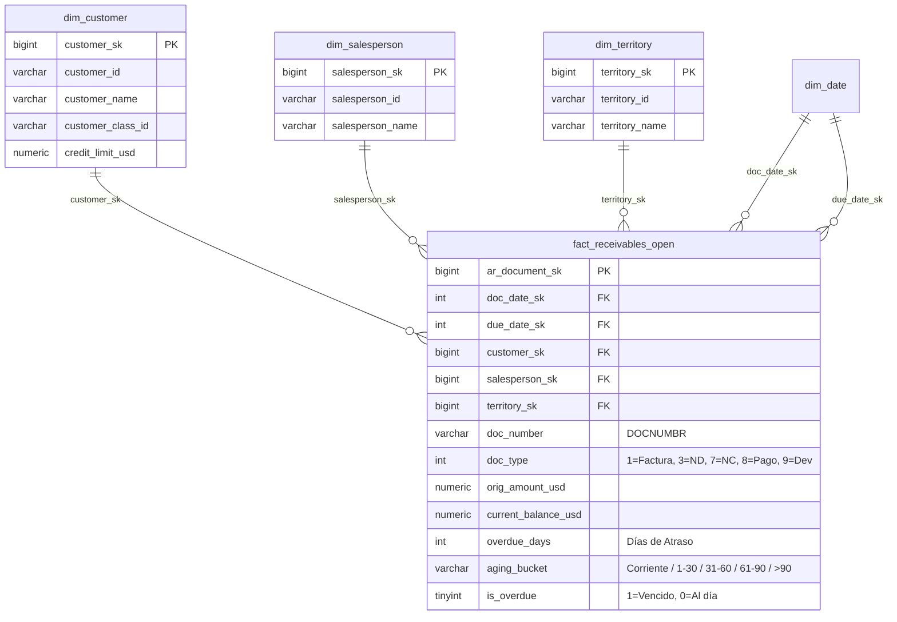

# Arquitectura Dimensional: Data Mart de Cuentas por Cobrar
**Rol**: Enterprise Data Warehouse Architect  
**Proyecto**: Data Mart de Cuentas por Cobrar - Grupo Ponce  

---

## Diagrama Entidad-Relación (ERD)

