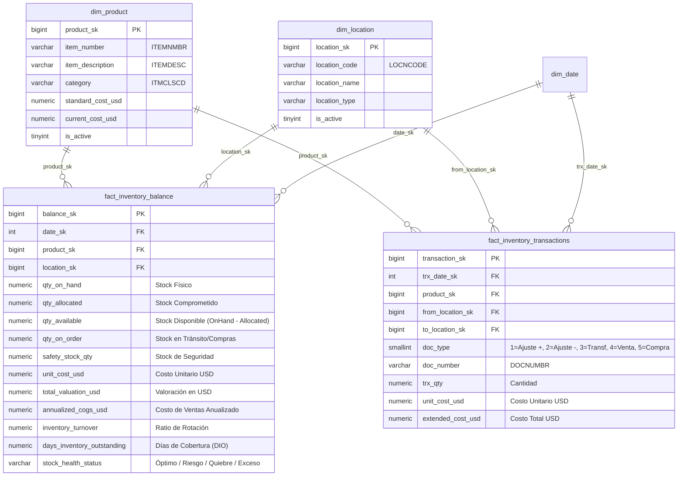

# Arquitectura Dimensional: Data Mart de Inventarios
**Rol**: Enterprise Data Warehouse Architect  
**Proyecto**: Data Mart de Inventarios - Grupo Ponce  

---

## Diagrama Entidad-Relación (ERD) en Estrella

