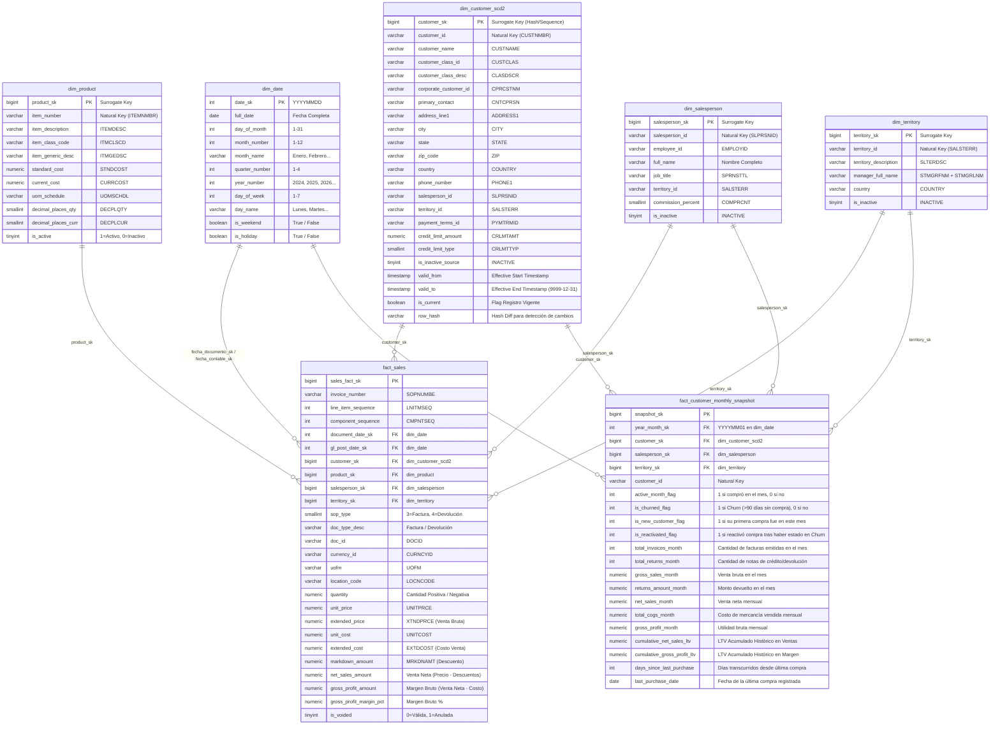

# Arquitectura del Data Mart: Esquema en Estrella con SCD Tipo 2
**Rol**: Enterprise Data Warehouse Architect  
**Proyecto**: Data Mart de Clientes y Ventas - Grupo Ponce  
**Fuente Origen**: Microsoft Dynamics GP (`RM00101`, `RM00201`, `RM00301`, `RM00303`, `SOP30200`, `SOP30300`, `IV00101`)

---

## 1. Diagrama Entidad-Relación (ERD) en Estrella

---

## 2. Estrategia de SCD Tipo 2 para `dim_customer`

Para preservar el historial de los cambios organizacionales y comerciales del cliente (por ejemplo, cambios de Vendedor Asignado, Territorio, Clase de Cliente o Límite de Crédito), la tabla `dim_customer` implementa **Slowly Changing Dimensions Tipo 2**:

1. **Clave Subrogada (`customer_sk`)**: Hash MD5/SHA256 o autoincremental combinando `CUSTNMBR + valid_from`.
2. **Columnas de Control Temporal**:
   - `valid_from`: Timestamp exacto de inicio de vigencia de la versión.
   - `valid_to`: Timestamp de fin de vigencia (por defecto `9999-12-31 23:59:59` para la versión activa).
   - `is_current`: Booleano `TRUE` para el registro vigente, `FALSE` para versiones históricas.
   - `row_hash`: Hash MD5 de los atributos rastreados para detectar mutaciones en el proceso de ingesta.
3. **Mapeo de Nulos / Registros Especiales**:
   - `customer_sk = -1`: `Cliente Desconocido / No Asignado`.
   - `customer_sk = -2`: `No Aplica`.

---

## 3. Especificación de Tablas de Hechos (Fact Tables)

### A. `fact_sales` (Granularidad: 1 fila por línea de documento de venta)
- **Granularidad de Negocio**: Una línea de artículo vendida o devuelta en una factura/nota de crédito (`SOP30200` + `SOP30300`).
- **Manejo de Devoluciones (`SOPTYPE = 4`)**: Cantidad (`QUANTITY`), Monto Extendido (`XTNDPRCE`) y Costo Extendido (`EXTDCOST`) se almacenan con signo aritmético negativo o normalizado para agregación directa $\sum$.

### B. `fact_customer_monthly_snapshot` (Granularidad: 1 fila por cliente y mes calendario)
- **Granularidad de Negocio**: Estado mensual acumulado de cada cliente para análisis de retención, Churn, frecuencia de compra y LTV histórico.
- **Particionamiento**: Particionado por `year_month_sk` (por ejemplo, `20260101`, `20260201`).
